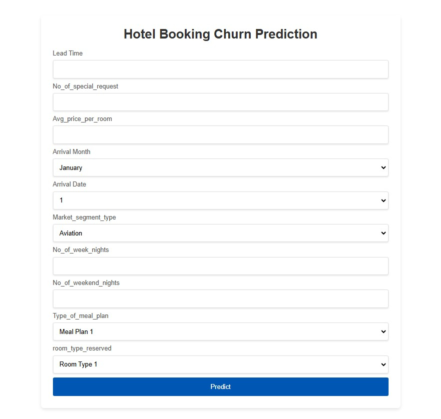

# Mi Proyecto MLOps: HOTEL BOOKING CHURN PREDICTION

Este es un proyecto MLOps end-to-end

## Aplicación Web


## Estructura del Proyecto

```plaintext
mlops_project/
│
├── artifacts/               # Modelos, datasets procesados, etc.
│   ├── models/              # Modelos entrenados
│   ├── datasets/            # Datasets procesados
│   └── logs/                # Logs de entrenamiento y evaluación
│
├── config/                  # Archivos de configuración
│   ├── __init__.py          # Inicialización del módulo de configuración
│   ├── settings.py          # Configuraciones generales
│   └── paths.py             # Rutas de archivos y directorios
│
├── notebooks/               # Jupyter Notebooks para análisis y experimentos
│   ├── exploration.ipynb    # Análisis exploratorio de datos
│   └── training.ipynb       # Entrenamiento de modelos
│
├── src/                     # Código fuente del proyecto
│   ├── __init__.py          # Inicialización del módulo src
│   ├── data/                # Procesamiento de datos
│   │   ├── __init__.py      # Inicialización del módulo data
│   │   └── preprocessing.py # Scripts de preprocesamiento
│   ├── models/              # Definición y entrenamiento de modelos
│   │   ├── __init__.py      # Inicialización del módulo models
│   │   └── train.py         # Scripts de entrenamiento
│   └── evaluation/          # Evaluación de modelos
│       ├── __init__.py      # Inicialización del módulo evaluation
│       └── metrics.py       # Cálculo de métricas
│
├── static/                  # Archivos estáticos (CSS, JS, imágenes)
│   ├── css/                 # Hojas de estilo CSS
│   └── images/              # Imágenes utilizadas en el proyecto
│
├── templates/               # Plantillas HTML
│   └── base.html            # Plantilla base para la interfaz web
│
├── utils/                   # Utilidades y funciones auxiliares
│   ├── __init__.py          # Inicialización del módulo utils
│   ├── helpers.py           # Funciones de ayuda
│   └── logger.py            # Configuración de logging
│
└── README.md                # Documentación del proyecto
